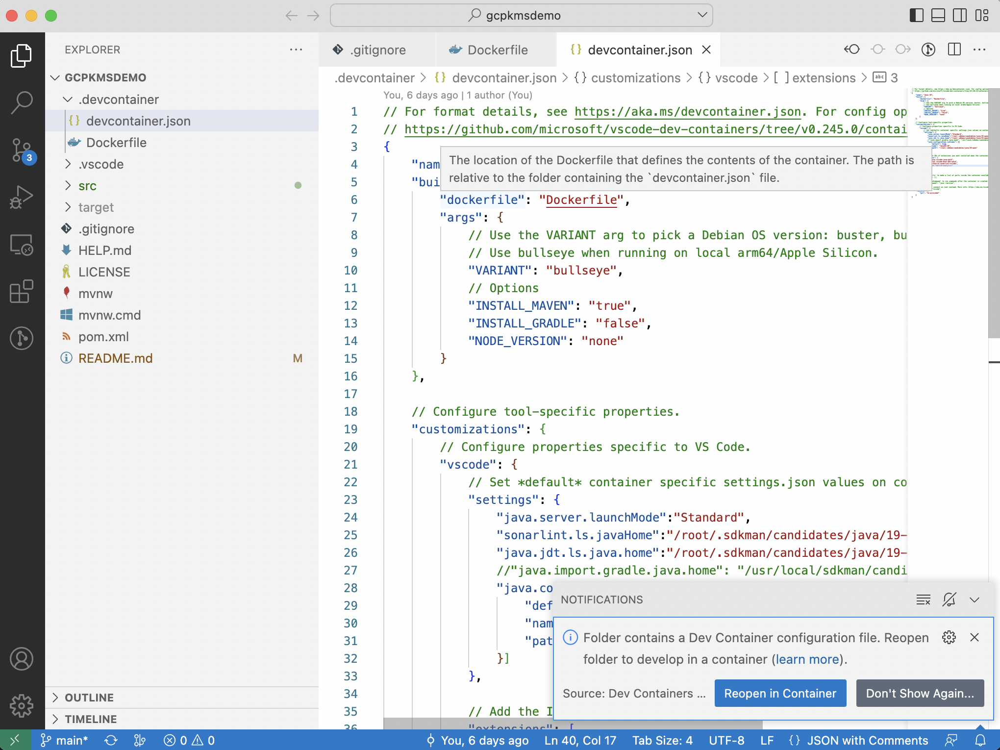

# About
GCP KMS demo is a very simple project written in spring boot. The objective if this web application is to evaluate performance of [Tink cryptography library] using Google Cloud Platform (GCP) Key Management System (KMS) service. It contains two API endpoints to encrypt and decrypt text.

# Local setup
Before trying to setup this project locally on your machine please follow instructions provided in [link](https://developers.google.com/tink/key-management-overview) for key management while using Tink. While creating service account do remember that the role should be `Cloud KMS CryptoKey Encrypter/Decrypter`. Also, use the command in [link](https://cloud.google.com/kms/docs/iam#granting_roles_on_a_resource) to grant a role that provides access to a Cloud KMS key. The JSON files for keyset and GCP service account credentials has to be copied in `resources` folder. Also, after that change the values for corresponding properties in `application.properties` file.

Once the keyset and credential files are placed in `resources` folder and properties values are set then to run this project locally on your machine please install following items first:
1. [vscode](https://code.visualstudio.com/)
2. [docker](https://www.docker.com/)
3. vscode dev container extension
4. [postman](https://www.postman.com/)

Once the prerequisites are installed then open project folder in vscode. There you will find a notification to reopen folder in a container. Just click on the button in the notification and you will be all set in a few minutes to run your application inside the container.

You can use the collection in folder `postman` and import it on your postman client to run tests and use APIs.

